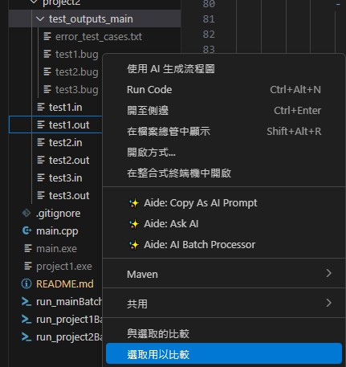
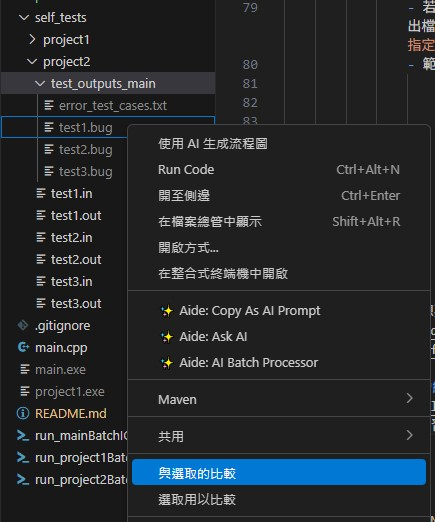
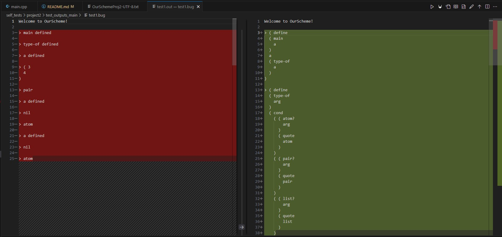
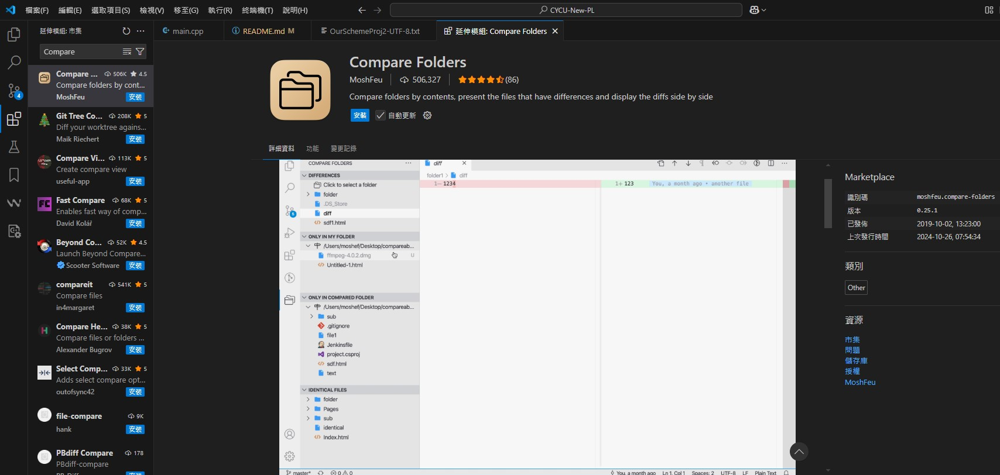

# CYCU-New-PL (中原資工程式語言project - OurScheme)
## 修課相關
- 本人修大四下畢業班，夏老大（夏延德）授課，計分方式與大三不同
- [Project 1 的簡報](https://www.canva.com/design/DAGemJ7sLQI/X3aeWBckMJEJuJ5ks3dF7w/edit)
- [Project 2 的簡報](https://www.canva.com/design/DAGhDegFZEU/uxxLU615FuWu6gMkWg2Aaw/edit)
- [Project 3 的簡報](https://www.canva.com/design/DAGm4BCQdFo/5O3Q9TywXnNS9H1M0772Vg/edit)
- 老大的上傳系統：
    - [設定密碼](https://pai.lab715.uk:5001/ChangePassword/)
    - [上傳檔案](https://pai.lab715.uk:5001/PL-PostCode/)
- 線上測試系統：
    - [互動式測試](https://cycu-ice-pl.github.io/website/#/OurScheme)
    - [合法S-Expression建立抽象語法樹的可視化](https://cycu-ice-pl.github.io/website/#/Visualize)
- 主要使用Discord bot測試與計分
    - 系統只會使用output測試，當有```std::cout```沒換行後接```std::cin```時應該不會吃，也因此我的Interactive I/O在印```> ```時會有問題，但使用指令輸出是正確的
    - [Discord bot 連結](https://discord.com/oauth2/authorize?client_id=1265725772094767149)
    - Discord bot 應用程式ID: ```1265725772094767149```
    - 題目數量：
        - Project 1: 10
        - Project 2: 16
        - Project 3: 12
        - Project 4: 10
        - 每題都會有三個測資檔
- 系統只吃一個檔案，所以要全部塞在同一檔案中
- 支援```C/C++```, ```Java```, ```Python```
- 平時分數計算：每堂課會有4分
    1. 出席分
    2. So so
    3. Ok
    4. Great
    0. Not good
- Project分數到80可以不用出席

## 進度
- Project 1 全過
- Project 2 卡三題隱測：5, 13, 15
- main打完Project3所有的功能實作，但有一堆bug沒修，但我過了

## 碎碎唸
- 我過了，所以不想繼續寫了，好懶
- 如果你直接抄，那準備下去吧你
- 卡隱測的時候去想想看是不是你前一個全過的project有漏掉東西（我project2原本卡四題隱測，把tokenizer重寫邏輯後就過了一題）
- 看完所有documents把整體架構架好在開始實作，不然你的code會亂到根本看不懂在幹嘛
- 夏老大沒考慮的東西挺多的，以線上系統的輸出維"正解"
- 有些時候互動式和寫檔的輸出不一樣，例如用到eof或cin.peek()時（我猜測是）因為他需要有輸入但互動式在等待使用者輸入導致必須多輸一個char（不過我的實作應該沒那個問題），反正DC系統是用寫檔測的所以沒差
- 學著寫腳本測試吧，每次打一大串```Get-Content``` + 路徑很煩
- 欸我應該是documents寫得最認真的了吧==
- 別抄襲，別盲目自信你能騙過抓抄襲系統
- 別找外包，你以為蝦皮和FB外包抓了多少個了
- 自己寫啦
- 三小時寫完project1，剩下三個在三天內搞定的強者朋友[老葉](https://github.com/oldper/PL_Project)
- 寫到project4，1&2全過，project3剩五題，project4剩三題的[學弟](https://github.com/York30678/OurScheme-Project)

## 我的實作
### [Project 1](./CompleteCodeByProjects/Project1.md)
### [Project 2](./CompleteCodeByProjects/Project2.md)
### [Project 2](./CompleteCodeByProjects/Project3.md)

## What is OurScheme?
- 它是中原資工大三下的**程式語言**課程Project，會有```OurC```與```OurScheme```兩種每年輪替，OurScheme是比較簡單的。
- ```OurC```要寫簡化版的```C```compiler, ```OurScheme```要寫簡化版的```Scheme```interpreter（一個使用Python實作的Scheme interpreter[見此](https://github.com/vladimirfomene/scheme-interpreter)，線上IDE[請點此](https://www.jdoodle.com/execute-scheme-online)）
- [Scheme](https://zh.wikipedia.org/zh-tw/Scheme)是[LISP](https://zh.wikipedia.org/wiki/LISP)的其中一種方言([dialect](https://en.wikipedia.org/wiki/Programming_language#Dialects,_flavors_and_implementations))，而```OurScheme```是此門課程將```Scheme```簡化後的方言（同理，```OurC```也是```C```的簡化方言）。
- 詳細實現內容請見[./AboutProject底下的OurSchemeProj{1/2/3/4}-UTF-8.txt](./AboutProject/)，現在新版的測試系統不會以```HowToWriteOurScheme.doc```為準，例如```ERROR (level of CLEAN-ENVIRONMENT) / ERROR (level of DEFINE) / ERROR (level of EXIT)```就不需實作。

## Project definitions
### Project 1
#### Syntax of S-expression
```EBNF
<S-exp> ::= <ATOM> | LEFT-PAREN <S-exp> { <S-exp> } [ DOT <S-exp> ] RIGHT-PAREN | QUOTE <S-exp>
<ATOM>  ::= SYMBOL | INT | FLOAT | STRING | NIL | T | LEFT-PAREN RIGHT-PAREN
```
#### Types of Terminal Tokens
```
LEFT_PAREN
RIGHT_PAREN
INT
STRING
DOT
FLOAT
NIL
T
QUOTE
SYMBOL
```
#### Exit and Error exceptions
##### Exit exceptions
1. Normal Exit
    ```
    Thanks for using OurScheme!
    ```
2. EOF & Exit
    ```
    ERROR (no more input) : END-OF-FILE encountered
    Thanks for using OurScheme!
    ```
##### Syntax exceptions
1. Unexpceted token
    ```
    ERROR (unexpected token) : atom or '(' expected when token at Line <line number> Column <column number> is >><token><<
    ```
2. Unexpceted token, not RIGHT_PAREN
    ```
    ERROR (unexpected token) : ')' expected when token at Line <line number> Column <column number> is >><token><<
    ```
3. No closing quote
    ```
    ERROR (no closing quote) : END-OF-LINE encountered at Line <line number> Column <column number>
    ```
### Project 2
#### Data types
TODO: set minor data type, e.g. procedure, int, float, bool..., etc., may follow ATOM's type or token's type.
#### Primitives and Features
1. Constructors (```CONSTRUCTOR```)
    - To construct a list or a (dotted) pair
    1. ```cons```:
        - **Must be 2** argument: 
        - **Return** ```list``` (i.e. pair, but pair is not primitive)
        - References:
            - [MIT Scheme Reference](https://groups.csail.mit.edu/mac/ftpdir/scheme-7.4/doc-html/scheme_8.html)
            - [PLT Scheme](https://cs.brown.edu/courses/cs173/2008/Manual/guide/Pairs__Lists__and_Scheme_Syntax.html)
        - Examples:
            ```Scheme
            (cons 3 4)
            ;( 3
            ;  .
            ;  4
            ;)
            (cons 3 ()) ; (3 . nil) and (3) are the same
            ;( 3
            ;)
            (cons 3 '(4321 5))
            ;( 3
            ;  4321
            ;  5
            ;)
            (cons '(1 2 . 3) 4)
            ;( ( 1
            ;    2
            ;    .
            ;    3
            ;  )
            ;  .
            ;  4
            ;)
            (cons (list 2 3) 1)
            ;( ( 2
            ;    3
            ;  )
            ;  .
            ;  1
            ;)
            (cons 1 (list 2 3))
            ;( 1
            ;  2
            ;  3
            ;)
            (cons (cons cons cons) (cons (cons cons cons) (cons cons cons)))
            ;( ( #<procedure cons>
            ;    .
            ;    #<procedure cons>
            ;  )
            ;  ( #<procedure cons>
            ;    .
            ;    #<procedure cons>
            ;  )
            ;  #<procedure cons>
            ;  .
            ;  #<procedure cons>
            ;)
            ```
    2. ```list```:
        - **At least 0** argument
        - **Return** ```list``` (i.e. pair)
        - Examples:
        ```Scheme
        (list)
        ;nil
        (list ())
        ;( nil
        ;)
        (list () nil ())
        ;( nil
        ;  nil
        ;  nil
        ;)
        ```
2. Bypassing the default evaluation (```BYPASS_EVALUATION```)
    - To bypass (avoid) the evaluation of a S-expression
    1. ```quote```:
        - **Must be 1** argument
        - **Return** ```list``` (i.e. pair)
        - Example:
            ```Scheme
            (quote (3 (4 5)))
            ;( 3
            ;  ( 4
            ;    5
            ;  )
            ;)
            ```
    2. ```'```:
        - **Must be 1** argument
        - **Return** ```list``` (i.e. pair)
        - Example:
            ```Scheme
            '((3 4) "Happy New Year!" . 6)
            ;( ( 3
            ;    4
            ;  )
            ;  "Happy New Year!"
            ;  .
            ;  6
            ;)
            ```
3. The binding of a symbol to an S-expression (```BINDING```)
    - To set a binding of a symbol, which is a primitive (recursive data type)
    1. ```define```:
        - **Must be 2** arguments
        - **Return** a binding, can be primitive or function or previous definitino
        - Once a symbol is defined (or "bound"), the user can enter this symbol, and the system will return its binding.
        - However, the user is not allowed to redefine symbols that happen to be system primitives such as ```cons``` or ```car``` or ```cdr```, etc.
        - Examples:
            ```Scheme
            (define add3 (lambda (x) (+ x 3)))
            ```
4. Part accessors (```PART_ACCESSOR```)
    - To get the value of the specific part
    1. ```car```:
        - **Must be 1** argument
    2. ```cdr```:
        - **Must be 1** argument
5. Primitive predicates (```PRIMITIVE_PREDICATE```)
    - To judge the given argument, aka judgement
    1. ```atom?```:
        - **Must be 1** argument
    2. ```pair?```:
        - **Must be 1** argument
    3. ```list?```:
        - **Must be 1** argument
    4. ```null?```:
        - **Must be 1** argument
    5. ```integer?```:
        - **Must be 1** argument
    6. ```real?``` & ```number?```:
        - **Must be 1** argument
        - In OurSchem, ```real?``` = ```number?```
    7. ```string?```:
        - **Must be 1** argument
    8. ```boolean?```:
        - **Must be 1** argument
    9. ```symbol?```:
        - **Must be 1** argument
6. Basic arithmetic, logical and string operations (```OPERATION```)
    - To operation what it should does and return it
    - Arithmetic operations:
        1. ```+```:
            - **At least 2** arguments
        2. ```-```:
            - **At least 2** arguments
        3. ```*```:
            - **At least 2** arguments
        4. ```/```:
            - **At least 2** arguments
    - Logical operations:
        - In evaluating ```and``` or ```or```, it is possible that some "argument expr" does not get evaluated. Use Petite Scheme to see what this means.
        - For instance:
            ```Scheme
            (set! a 5)
            a
            (and (set! a 10) #f (set! a 100))
            a
            (or #t (set! a 200))
            a
            ```
        1. ```not```:
            - **Must be 1** argument
        2. ```and```:
            - **At least 2** arguments
        3. ```or```:
            - **At least 2** arguments
        4. ```>```:
            - **At least 2** arguments
        5. ```>=```:
            - **At least 2** arguments
        6. ```<```:
            - **At least 2** arguments
        7. ```<=```:
            - **At least 2** arguments
        8. ```=```:
            - **At least 2** arguments
    - String operations:
        1. ```string-append```:
            - **At least 2** arguments
        2. ```string>?```:
            - **At least 2** arguments
        3. ```string<?```:
            - **At least 2** arguments
        4. ```string=?```:
            - **At least 2** arguments
7. Eqivalence tester (```EQIVALENCE_TESTER```)
    - To judge if the value or (and) definition (aka atom) is the same
    1. ```eqv?```:
        - **Must be 2** arguments
    2. ```equal?```:
        - **Must be 2** arguments
8. Sequencing and functional composition (```SEQUENCING_AND_FUNCTIONAL_COMPOSITION```)
    1. ```begin```:
        - **At least 1** argument: primitive
        - **Return** the value of the sequence / function / operation
        - It is necessary every time you need several forms when the syntax allows only one form. For instance, if you need to increment a variable y each time you use it:
            ```Scheme
            ((set! r 5) 4) ; set! return 5 -> (5 4) -> ERROR (attempt to apply non-function) : 5
            (begin (set! r 5) 4) ; set! return 5 -> (begin 5 4) -> begin return 4 -> 4
            ```
        - The following are the same:
            ```Scheme
            (car (cdr '(1 2 3 4))) ; cdr return (2 3 4) -> car return 2 -> 2
            (begin (car (cdr '(1 2 3 4)))) ; cdr return (2 3 4) -> car return 2 -> begin return 2 -> 2
            ```
9. Conditionals (```CONDITIONAL```)
    - In evaluating ```if``` or ```cond```, it is possible that some "sub-expr" does not get evaluated (this is the meaning of conditional expressions). Use Petite Scheme to check.
    1. ```if```:
        - **Specifically 2 or 3** arguments
        - **Return** the binding by condition
        - if the condition is true -> 2 or 3 arguments
        - if the condition if false -> must be 3 arguments
        - Examples:
            ```Scheme
            (if #t 'true) ; true -> 2 arguments
            ; true
            (if (not nil) 'true 'false) ; true -> 3 arguments
            ; true
            (if (not #t) 'true) ; false -> 2 arguments will error
            ;ERROR (no return value) : ( if
            ;  ( not
            ;    #t
            ;  )
            ;  ( quote
            ;    true
            ;  )
            ;)
            (if (equal? 1 2) 'true 'false) ; false -> must be 3 arguments
            ; false
            ```
    2. ```cond```:
        - **At least 1** argument
        - **Return** the binding by condition
        - Use switch-case to think, but must have return value:
            ```Scheme
            (cond ((< 1 0) 'compare_action1 'compare_action2) ; condi 1
                  (nil 'nil_action1 "nil_action2") ; condi 2
                  (< 1 2) ; condi 3
                  (#t '#t_action1 '#t_action2) ; condi 4
                  (else 'else_action1 'else_action2) ; condi 5
            )
            ```
            is same as
            ```C++
            if (1 < 0) { // condi 1
                // get the value of 'compare_action1
                // get the value of 'compare_action2
                // return the value of 'compare_action2
            }
            else if (false) { // condi 2
                // get the value of 'nil_action1
                // get the value of "'nil_action2"
                // return the value of "'nil_action2"
            }
            else if (<) { // condi 3 // must go here because this is a primitive
                // get the value of 1
                // get the value of 2
                // return the value of 2
            }
            else if (true) { // condi 4 // if this condition if former than <, will go here
                // get the value of '#t_action1
                // get the value of '#t_action2
                // return the value of #t_action2
            }
            else { // condi 5
                // get the value of 'else_action1
                // get the value of else_action2
                // return the value of else_action2
            }
            ```
            and will go *condi 3*.
        - Example:
            ```Scheme
            (cond ((< 1 2) cons)
            )
            ;#<procedure cons>
            (cond ((> 3 4) 'bad)
                  ((> 4 5) 'bad)
            ) ; because the 2 conditions are false, must have else here
            ;ERROR (no return value) : ( cond
            ;  ( ( >
            ;    3
            ;    4
            ;    )
            ;    ( quote
            ;    bad
            ;    )
            ;  )
            ;  ( ( >
            ;    4
            ;    5
            ;    )
            ;    ( quote
            ;    bad
            ;    )
            ;  )
            ;)
            ```
    3. ```else```:
        - - **At least 1** argument
        - **Return** the binding by condition
        - It is a keyword (and not a reserve word) in OurScheme (or rather, Scheme).
        - According to our textbook (by Sebesta), a keyword has a special meaning ONLY WHEN it appears in some special contexts.
        - When the word appears in contexts that are not special, the word is just an "ordinary word".
        - ```else``` has a special meaning only when it appear as the first element of the last condition of 'cond' ; in all other cases, ```else``` is considered a normal symbol.
        - Examples:
            ```Scheme
            (cond ((< 1 0) 'act1)
                ('must_here) ; because must here, should have at least 1 action, and don't need else
            )
            ;ERROR (COND format) : ( cond
            ;  ( ( <
            ;      1
            ;      0
            ;    )
            ;    ( quote
            ;      act1
            ;    )
            ;  )
            ;  ( ( quote
            ;      must_here
            ;    )
            ;  )
            ;)
            (cond ((< 1 0) 'act1)
                ('must_here 'act1 (list) 4) ; because must here,so don't need else
            )
            ;4
            (cond ((< 1 0) 'act1)
                  (nil 'act2 (list) 4)
                  (else 'act3 'end_else) ; because the first 2 conditions must be false, so else must be required
            )
            ;end_else
            ```
10. clean-environment (```CLEAN_ENV```)
    1. ```clean-environment```:
        - **Must be 0** argument
        - Clear all definitions
        - Examples:
            ```Scheme
            (cond ((< 1 0) 'act1)
                  (nil 'act2 (list) 4)
                  (else (clean-environment) 'end_else) ; because the first 2 conditions must be false, so else must be required
            )
            ;ERROR (level of CLEAN-ENVIRONMENT)
            ```
11. Exit (```EXIT```)
    1. ```exit```:
        - **Must be 0** argument
        - Exit OurScheme
#### Error exceptions
##### Semantic exceptions
1. Format error: define
    ```
    ERROR (DEFINE format) : <S-exp>
    ```
2. Format error: cond
    ```
    ERROR (COND format) : <S-exp>
    ```
3. ATOM error: Apply non-function
    ```
    ERROR (attempt to apply non-function) : <ATOM>
    ```
4. ATOM error: Unbound symbol
    ```
    ERROR (unbound symbol) : <SYMBOL>
    ```
5. Argument error: ```<S-exp>``` is not a pure list
    ```
    ERROR (non-list) : <S-exp>
    ```
6. Argument error: incorrect argument type
    ```
    ERROR (<PRIMITIVE> with incorrect argument type) : <S-exp>
    ```
7. Argument error: incorrect number of argument(s)
    ```
    ERROR (incorrect number of arguments) : <PRIMITIVE>
    ```
8. Function error: no return value
    ```
    ERROR (no return value) : <S-exp>
    ```
9. Operatoin error: division by 0
    ```
    ERROR (division by zero) : /
    ```
### Project 3
#### Reserve words
```
quote
and
or
begin
if
cond
define
lambda
set!
let
```
```let```, ```lambda``` and ```define``` are three of the above mentioned reserve words. They are not functions. Whenever a reserve word appears, the system should check the syntax of the related code fragment.
Though S-expressions starting with any one of the above ten reserve words are actually "forms" and not functions, some of them may nevertheless return values. For this reason, we will also refer to these "forms" as "functional forms".
#### Special reserve words
#### ```let```
```Scheme
(let (<sS1>) <sS2>)
```
- At least 2 parameters
- First: ```(<sS1>)```
    - A list of zero or more pairs
    - ```<sS1>``` is a sequence of S-expressions, with each S-expression ```S1``` being of the form:
        ```Scheme
        ( SYMBOL S-expression )
        ```
    - The ```<sS1>``` are **local bound symbol**, i.e. only bound in ```let```
- Second: ```<sS2>```
    - ```<sS2>``` is a **non-empty** sequence of S-expressions.
    - The "LET-defined" local variables (i.e., 'x' and 'y') can appear in these S-expressions, and the system knows what their bindings are (i.e., bound before).
    - The evaluated result of the last S-expression in '.........' is taken to be the evaluated result of the entire LET expression.
- Example:
    ```Scheme
    (let ((a 4) (b 5)); <sS1> = ((a 4) (b 5)), pair1 = (a 4), pair2 = (b 5)
      (list (list a b)); the first <S-exp> in sS1, only be evaluated
      (list (list ab a)); the first <S-exp> in sS1, be evaluated and returned
    )
    ; print the return value: last <S-exp> in <sS2>
    ;( ( 5
    ;    4
    ;  )
    ;)

    (let (a 4) ()) ; <sS1> should be ((a 4)) not (a 4)
    ;ERROR (LET format) : ( let
    ;  ( a
    ;    4
    ;  )
    ;  nil
    ;)

    (let ((a 4)) ())
    ;nil
    a ; a ls a local symbol
    ;ERROR (unbound symbol) : a

    (let ((a 4)) a) ; return the local symbol's value
    ;4

    (eqv? 4 (let ((a 4)) a)) ; compare the value of return
    ;#t    
    ```
#### ```lambda```
- At least 2 params
- First:
    - A list of **symbol**s (i.e. only symbol), at least 0, i.e. the arguments of the function being defined by the lambda expression.
- Second and the after:
    - The one-or-more-S-expressions constitute the function's body.
    - return the last action's result
- Example:
    ```Scheme
    (lambda () 'do_1 'do_2)
    ;#<procedure lambda>

    (list (lambda () 'do_1 'do_2))
    ;( #<procedure lambda>
    ;)

    ((lambda () 'do_1 'do_2))
    ;do_2
    
    (list ((lambda () 'do_1 'do_2)))
    ;( do_2
    ;)

    (lambda (3) (+ x 1 c "") ())
    ERROR (LAMBDA format) : ( lambda
    ;  ( 3
    ;  )
    ;  ( +
    ;    x
    ;    1
    ;    c
    ;    ""
    ;  )
    ;nil
    ;)

    (lambda (x) (+ x 1 c "") ()) ; don't evaluate
    ;#<procedure lambda>

    (define f (lambda (x) (+ x 1 c "") ())) ; don't evaluate lambda
    ; f defined

    ((lambda (x) (+ x 1 c "") ()))
    ;ERROR (incorrect number of arguments) : lambda

    ((lambda (x) (+ x 1 c "") ()) 1)
    ;ERROR (unbound symbol) : c

    ((lambda (x) (+ x 1 3 "") ()) 1)
    ;ERROR (+ with incorrect argument type) : ""

    (define f (lambda (3) (+ x 1 c "") ())) ; 3 is not symbol
    ERROR (LAMBDA format) : ( lambda
    ;  ( 3
    ;  )
    ;  ( +
    ;    x
    ;    1
    ;    c
    ;    ""
    ;  )
    ;nil
    ;)

    ((lambda (x) (+ x 1 3) ()) 1)
    ;nil

    (define f ((lambda (x) (+ x 1 3) ()) 1) )
    ;nil
    ```
#### ```define```
```Scheme
( define SYMBOL S-expression )
; or
( define ( SYMBOL zero-or-more-symbols ) one-or-more-S-expressions )
```
- Must appear at the top level
- Examples:
```Scheme
(define main ()) ; define main is a symbol bound to nil
;main defined
main
;nil
(main)
;ERROR (attempt to apply non-function) : nil

(define (main) (list 1) (list 2) (list 3)) ; no arguments
;main defined
main
;#<procedure main>
(main)
;( 3
;)

(define (main a b c) (list a) (list b) (list c)) ; 3 arguments
;main defined
main
;#<procedure main>
(main)
;ERROR (incorrect number of arguments) : main
(main 3 '(test) "") ; return the last action (list c)
;( ""
;)

( define f ( lambda (x) (+ x x c)))
;f defined
f
;#<procedure lambda>
(f)
;ERROR (incorrect number of arguments) : lambda
(f 1)
;ERROR (unbound symbol) : c
(define c 10)
;c defined
(f c)
;12

(define cadr (lambda (x) (car (cdr x))))
;cadr defined
cadr
;#<procedure lambda>
(cadr)
;ERROR (incorrect number of arguments) : lambda
(cadr '(1 2 3 4))
;2

(define a 2)
;a defined
(define plus_twice (lambda (x) (+ x x c)))
;plus_twice defined
plus_twice
;#<procedure lambda>
(plus_twice 1)
ERROR (unbound symbol) : c
(define c 2)
;c defined
(plus_twice a)
;6

(define ( do_plus_20 x ) (plus_20 x x))
;do_plus_20 defined
(define (plus_20 used_arg unused_arg) (+ used_arg 20))
;plus_20 defined
(plus_20 10)
;ERROR (incorrect number of arguments) : plus_20
(plus_20 10 0)
;30
(do_plus_20 10)
;30
```
#### Verbose mode
- To print the details about the system
the "verbose" mode controls whether the system will print something when the being evaluated S-expression is ```DEFINE``` or ```CLEAN-ENVIRONMENT```
- Default mode is on
- ```verbose```
    - To set verbose mode
    - return boolean
    - 1 argument (S-expression)
    - ```(verbose nil)``` vs. ```(verbose #t)``` ; #t can be replaced by any S-expression that evaluates to NOT NIL
- ```verbose?```
    - To check if the verbose mode on
    - return boolean
    - 0 argument
- Example:
    ```Scheme
    ; default is on
    (verbose?)
    ;#t
    (verbose? (not (not (not (and #t nil)))))
    ;ERROR (incorrect number of arguments) : verbose?
    (not (not (and #t nil)))
    ;nil

    ; print define and clean-environment messages when on
    (define a 5)
    ;a defined
    (clean-environment)
    ;environment cleaned

    ; set to off
    (verbose (not (not (and #t nil)))) ; get the return value of (not (not (and #t nil))) and set it
    ;nil
    (verbose?)
    ;nil

    ; don't print messsage, just print "\n" when off
    (define a 5)
    ;
    (clean-environment)
    ;

    ; reset to on
    (verbose (not (eqv? "" "")))
    ;#t
    ```
#### Error exceptions
- Total function: has return
- Partial function: no return
    - No Return is Error:
        ```Scheme
        (define (F x) (cond ((> x 5) x)))
        ;F defined
        (F 3)
        ;ERROR (no return value) : ( F
        ;  3
        ;)
        ```
    - No Return is OK:
        ```Scheme
        (define (F x) (cond ((> x 5) x)))
        ;F defined
        (begin (F 3) 5)
        ;5
        (begin (begin (F 3)) 5)
        ;5
        ```
### Project 4
#### Error objects
- A new datatype ```ERROR_OBJECT```
- An error-object "contains" a string (an appropriately phrased error message), and "behaves" just like a string-object, i.e. just a special type, but the value is a string.
- error-object v.s. string-object:
    1. while 'error-object?' returns #t in the case of an error-object, it returns nil in the case of a string-object.
    2. while string-objects can be read in, error-objects cannot. Error-objects can only be explicitly created by calling 'create-error-object'. Calling the function 'read' 
    may also result in an error object to be implicitly created, as described below.
##### ```create-error-objects```
- function
- only 1 argument, a string
- return error-object
##### ```error-object?```
- function
- 1 argument: ```<S-exp>```
- return boolena, if the argument is a error-object
#### I/Os
##### ```read```
- ```main()```
- 0 arguments
- It attempts to first read in the next input S-expression and then return (the internal representation of) that S-expression.
##### ```write```
##### ```display-string```
##### ```newline```
#### Functions
##### ```symbol->string```
##### ```number->string```
##### ```eval```
##### ```set!```
## Commands
- Windows Powershell:
    - Warning:
        - 不要用cmd，也不要用```.bat```撰寫單元測試腳本，會有CRLF問題（你的程式輸出檔有時會在最後被插入換行，有時又有幾個```<S-exp>```的output被吃掉）
    - 編譯：
        ```powershell
        # g++ {程式檔本體} -std={C++版本} -o {編譯輸出檔路徑}
        g++ ./main.cpp -std=c++2a -o ./main # current progress
        g++ ./CompleteCodeByProjects./project1.cpp -std=c++2a -o ./project1 # complete project1
        # ...其餘同理
        ```
    - 執行：
        - Interactive I/O:
            ```powershell
            # {執行檔路徑}
            ./main.exe # current progress
            ./project1.exe # complete project1
            # ...其餘同理
            ```
        - Batch I/O (acceptance tests):
            - 所有的input檔案以```.in```為副檔名，正確output檔案以```.out```為副檔名，自己的程式輸出我習慣以```.bug```為副檔名
            1. Single test case: 僅測試單一指定測資
                ```powershell
                # 以project1的test1.in為例
                # Get-Content {輸入檔路徑} | {執行檔路徑} > {輸出檔路徑}
                Get-Content ./self_tests./project1./test1.in | ./main.exe > ./self_tests./project1./main_test1.bug
                Get-Content ./self_tests./project1./test1.in | ./project1.exe > ./self_tests./project1./project1_test1.bug
                # 執行完自行與test1.out比對
                ```
            2. Multiple test cases: 測試整個project中的所有測資（以project1為例）
                - 請見```run_mainBatchIO.ps1```, ```run_project1BatchIO.ps1```, ```run_project2BatchIO.ps1```等powershell腳本
                - 因為main.cpp是最新進度，所以請在```run_mainBatchIO.ps1```的```$testDir = "./self_tests/project2" # change the number of your current-working project here```修改你要測試的project
                - 其餘```.ps1```腳本是針對特定project的測試，會使用```{指定project}.cpp```去測試
                - 執行腳本：
                    ```powershell
                    # {powershell腳本路徑}
                    ./run_mainBatchIO.ps1 # current progress
                    ./run_project1BatchIO.ps1 # complete project1
                    # ...其餘同理
                    ```
                - 它會先編譯```{指定程式本體}.cpp```為```{指定執行檔}.exe```，再將```./self_tests./{指定project}```底下的```{所有測資}.in```送進你的程式執行檔，並將輸出寫入到```.self_tests./{指定project}./test_outputs_{去掉副檔名的指定程式名稱}./{所有測資}.bug```，再以```./self_tests./{指定project}./{所有測資}.out```和你的程式輸出之```.bug```比對
                - 若所有測資皆正確，會在terminal顯示訊息，並將```./self_tests./{指定project}./test_outputs_{去掉副檔名的指定程式名稱}```刪除
                - 若有測資錯誤，會在terminal顯示訊息，並將與```.out```不同的```.bug```輸出檔檔名寫入```./self_tests./{指定project}./test_outputs_{去掉副檔名的指定程式名稱}./error_test_cases.txt```，其餘正確的不會保留
                - 範例terminal輸出(main.cpp, project1)：
                    ```powershell
                    # 1. 正確輸出，完全沒有錯誤
                    [main.cpp]: All tests are correct!
                    # 2. test3和test7錯誤
                    ## 2-1. error_test_cases.txt會寫入test3.bug與test7.bug（各檔名自成一行）
                    ## 2-2. 在./self_tests./project1./test_outputs_main中會有三個檔案：error_test_cases.txt, test3.bug與test7.bug
                    [main.cpp]: test3.bug is not equal to test1.out.
                    [main.cpp]: test7.bug is not equal to test2.out.
                    [main.cpp]: 2 error case(s) are found!
                    ```
            - 如果想要順便學用powershell寫測試腳本，可以參考[Pester官方文檔](https://pester.dev/docs/quick-start)及[微軟的測試檔解釋](https://devblogs.microsoft.com/scripting/unit-testing-powershell-code-with-pester/)
- Linux / macOS:
    - 坑很多
    - 所有測資應該使用```LF```而非```CRLF```
    - 並且因為Unix系統要求每一行結尾必須要有換行```\n```，因此：
        - 印出檔案最後一個字元
            ```shell
            # 例如 self_tests/project1/LF/test3.in 結尾有"\n"
            tail -c 1 self_tests/project1/LF/test3.in | od -a | awk '{print $2}'
            # 如果結尾有換行就會印出
            nl
            
            # 例如 self_tests/project1/LF/test7.in 結尾沒有"\n"，則印出最後一個字元
            tail -c 1 self_tests/project1/LF/test7.in | od -a | awk '{print $2}'
            t

            ```
        - 使用指令在檔案末尾加上```\n```
            ```shell
            # 假設目前資料夾底下有個test.in結尾沒有換行
            sed -i -e '$a\' test.in
            ```
    - 編譯：
        ```shell
        # main
        g++ main.cpp -std=c++2a -o ./main
        # project1 及其它
        g++ CompleteCodeByProjects/project1.cpp -std=c++2a -o ../project1
        ```
    - 執行：
        - Interactive I/O
            ```shell
            # main
            ./main
            # project1 及其它
            ./project1
            ```
        - Batch I/O
            - 單一檔案寫入：
                ```shell
                # 以project 1 test7.in為例
                ./project1 < self_tests/project1/LF/test7.in > self_tests/project1/LF/test7.bug
                ```
            - 批次檔：在```run_projectBatchIO```中的check部分，如果你想要直接對沒有末尾換行的插入：
                ```shell
                # 檢查並插入
                if [ "$(tail -c 1 "$input_file" | od -a | awk '{print $2}')" != "nl" ]; then
                    sed -i -e '$a\' "$input_file"
                fi
                # 將輸入測資用程式寫輸出檔
                "$exe_path" < "$input_file" > "$output_file"
                ```
- 比對：
    - 在大二的**組合語言與嵌入式系統**課程使用的[WinMerge](https://winmerge.org/downloads/?lang=zh_tw)是最熟悉的老熟人
    - 但我自己的習慣是使用VScode內建的比對功能
        
        
        
    - 你也可以使用extension，例如[Compare Folders](https://marketplace.visualstudio.com/items?itemName=moshfeu.compare-folders)：
        

## Structure
```
CYCU-New-PL
├──2025-02-19-hsia-Notes2025-02-19-hsia-Notes // 夏老大的筆記
│ ├──2025-02-19-ClassNotes.txt
│ ├──mMyShell-n.cpp
│ ├──mMyShell.cpp
│ ├──myShell-01.cpp
│ ├──myShell-01n.cpp
│ ├──myShell-02.cpp
│ ├──myShell-02n.cpp
│ ├──myShell-03.cpp
│ ├──myShell-03n.cpp
│ ├──MyShell-Series-Rationale.txt
│ ├──PL-113-2-MidtermReview-I.txt
│ ├──PL113-2-Project.zip
│ └──Tree的建造-UTF-8.txt
├──AboutProject // 整個project的所有說明文檔
│ ├──HowToCorrectlyGetNextToken-UTF-8.txt
│ ├──HowToWriteOurScheme.doc
│ ├──OurSchemeIntro.doc
│ ├──OurSchemeProj1-UTF-8.txt
│ ├──OurSchemeProj2-UTF-8.txt
│ ├──OurSchemeProj3-UTF-8.txt
│ ├──OurSchemeProj4-UTF-8.txt
│ ├──ThreeLisps-UTF-8.txt
│ └──Tree的建造-UTF-8.txt
├──AboutRecursiveDescentParsing // 夏老大的parsing筆記
│ ├──NeedOfFIRSTset.txt
│ └──RecursiveDescentParsing-Intro.doc
├──CompleteCodeByProjects // 對應project的完整程式碼及說明文件，一個project完成才會丟
│ ├──Project1.cpp
│ ├──Project1.md
│ ├──Project2.cpp
│ └──Project2.md
├──pictures // 說明用圖片
│ ├──choose_to_compare.jpeg
│ ├──compare_folders.jpeg
│ ├──compare_with_chosen.jpeg
│ └──native_compare.jpeg
├──self_tests // 自訂義的測資，部分為測試系統官方的，理論上全過就能過測試系統
│ ├──project1
│ │   ├──CRLF
│ │   |  ├──test1.in
│ │   |  ├──test1.out
│ │   |  ├──test2.in
│ │   |  ├──test2.out
│ │   |  ├──test3.in
│ │   |  ├──test3.out
│ │   |  ├──test4.in
│ │   |  ├──test4.out
│ │   |  ├──test5.in
│ │   |  ├──test5.out
│ │   |  ├──test6.in
│ │   |  ├──test6.out
│ │   |  ├──test7.in
│ │   |  ├──test7.out
│ │   |  ├──test8.in
│ │   |  ├──test8.out
│ │   |  ├──test9.in
│ │   |  ├──test9.out
│ │   |  ├──test10.in
│ │   |  └──test10.out
│ │   └──LF
│ │      ├──test1.in
│ │      ├──test1.out
│ │      ├──test2.in
│ │      ├──test2.out
│ │      ├──test3.in
│ │      ├──test3.out
│ │      ├──test4.in
│ │      ├──test4.out
│ │      ├──test5.in
│ │      ├──test5.out
│ │      ├──test6.in
│ │      ├──test6.out
│ │      ├──test7.in
│ │      ├──test7.out
│ │      ├──test8.in
│ │      ├──test8.out
│ │      ├──test9.in
│ │      ├──test9.out
│ │      ├──test10.in
│ │      └──test10.out
│ └──project2
│ │   ├──CRLF
│ │   |  ├──test1.in
│ │   |  ├──test1.out
│ │   |  ├──test2.in
│ │   |  ├──test2.out
│ │   |  ├──test3.in
│ │   |  ├──test3.out
│ │   |  ├──test4.in
│ │   |  ├──test4.out
│ │   |  ├──test5.in
│ │   |  ├──test5.out
│ │   |  ├──test6.in
│ │   |  ├──test6.out
│ │   |  ├──test7.in
│ │   |  ├──test7.out
│ │   |  ├──test8.in
│ │   |  ├──test8.out
│ │   |  ├──test9.in
│ │   |  ├──test9.out
│ │   |  ├──test10.in
│ │   |  ├──test10.out
│ │   |  ├──test11.in
│ │   |  ├──test11.out
│ │   |  └──test12.in // 有不會出現或夏老大沒處理的case
│ │   └──LF
│ │      ├──test1.in
│ │      ├──test1.out
│ │      ├──test2.in
│ │      ├──test2.out
│ │      ├──test3.in
│ │      ├──test3.out
│ │      ├──test4.in
│ │      ├──test4.out
│ │      ├──test5.in
│ │      ├──test5.out
│ │      ├──test6.in
│ │      ├──test6.out
│ │      ├──test7.in
│ │      ├──test7.out
│ │      ├──test8.in
│ │      ├──test8.out
│ │      ├──test9.in
│ │      ├──test9.out
│ │      ├──test10.in
│ │      ├──test10.out
│ │      ├──test11.in
│ │      └──test11.out
│ └──project3
│ │   ├──CRLF
│ │   |  ├──test1.in
│ │   |  ├──test1.out
│ │   |  ├──test2.in
│ │   |  ├──test2.out
│ │   |  ├──test3.in
│ │   |  ├──test3.out
│ │   |  └──test10.in // 有不會出現或夏老大沒處理的case
│ │   └──LF
├──.gitignore
├──README.md // overview
├──main.cpp // 我的最新project進度
├──run_mainBatchIO.ps1 // main.cpp的multi-test-cases測試腳本
├──run_project1BatchIO.ps1 // project1.cpp的multi-test-cases測試腳本
└──run_project2BatchIO.ps1 // project2.cpp的multi-test-cases測試腳本
```
